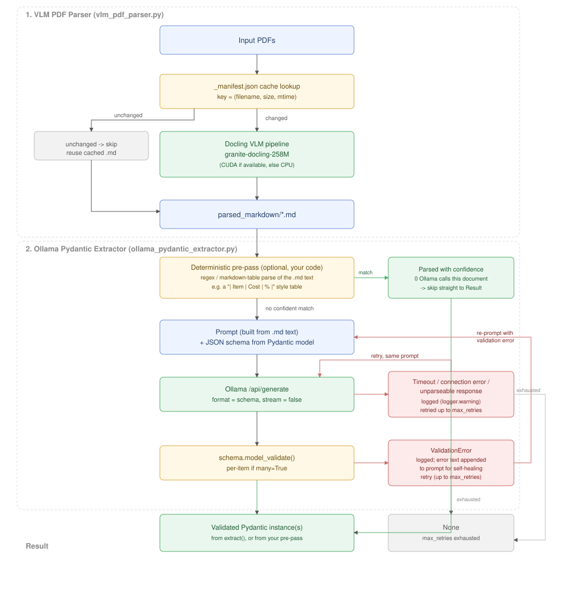

# Local AI Document Tools

A toolkit for processing unstructured documents locally. It contains two independent but complementary tools:

1. **VLM PDF Parser**: Converts raw PDFs into clean Markdown using IBM's Docling Vision-Language Model.
2. **Ollama Pydantic Extractor**: Extracts strict JSON from Markdown/text using local Ollama models and Pydantic schemas.

 Markdown -> Ollama extraction -> validated Pydantic output flowchart">

---

## 1. VLM PDF Parser (`vlm_pdf_parser.py`)

A GPU-accelerated CLI tool for converting directories of PDFs to Markdown. It features a smart caching layer that hashes file names, sizes, and modification times so you never accidentally re-run an expensive VLM pass on an unchanged file. Matching is case-insensitive (`.pdf`/`.PDF`) and can optionally recurse into subdirectories.

Note on the cache: the key is `(name, size, mtime)`, not a content hash. That's cheap and fine for local edit-and-rerun workflows, but a fresh `git clone` or Docker copy resets mtimes, so the first run there will look like everything changed and reconvert.

### Dependencies
```bash
pip install -r requirements.txt
```

### Usage (CLI)

```bash
# Convert all PDFs in the current directory, save to ./parsed_markdown
python vlm_pdf_parser.py

# Specify input and output directories
python vlm_pdf_parser.py --input-dir /path/to/pdfs --output-dir /path/to/output

# Also search subdirectories
python vlm_pdf_parser.py --input-dir /path/to/pdfs --recursive

# List PDFs without converting
python vlm_pdf_parser.py --input-dir /path/to/pdfs --list

# Ignore the cache and force re-conversion
python vlm_pdf_parser.py --force

# Share one global model weights cache across output dirs (default: ~/.cache/huggingface)
python vlm_pdf_parser.py --model-cache-dir ~/.cache/huggingface

# Use a different VLM (any attribute name in docling.datamodel.vlm_model_specs)
python vlm_pdf_parser.py --model SMOLDOCLING_TRANSFORMERS
```

---

## 2. Ollama Pydantic Extractor (`ollama_pydantic_extractor.py`)

A robust, generic utility for structured extraction using local LLMs (via Ollama) and Pydantic. It solves a core problem with small local models: getting them to reliably output strict JSON that matches a specific schema, using a self-healing retry loop.

### Features

- **Schema-Constrained Generation**: Automatically derives JSON schemas from your Pydantic models and passes them to Ollama's `format` parameter.
- **Self-Healing Retries**: If the model hallucinates an incorrect data type or misses a required field, the extractor catches the Pydantic `ValidationError` and feeds the exact error message back into a retry prompt, allowing the model to correct its mistake.
- **Many vs Single**: Built-in support for extracting a single object or an array of objects (`many=True`).

### Dependencies
```bash
pip install -r requirements.txt
```
*Requires Ollama running locally (default: `http://localhost:11434`).*

Failures are logged via the standard `logging` module (network errors, unparseable responses, and per-item validation misses each get a `logger.warning`) rather than silently swallowed — configure `logging.basicConfig(level=logging.WARNING)` in your own script to see them. A connection failure or timeout now also retries (up to `max_retries`, unmodified prompt) instead of giving up immediately, separately from the validation-error retry path.

### Usage (Python)

#### Single Object Extraction

```python
from pydantic import BaseModel
from ollama_pydantic_extractor import OllamaExtractor

class UserProfile(BaseModel):
    name: str
    age: int
    is_active: bool

extractor = OllamaExtractor(model="gemma3:12b")

prompt = "Extract the user profile from this text: 'John Doe is 28 years old and his account is currently active.'"
result = extractor.extract(prompt, schema=UserProfile)

if result:
    print(result.name) # John Doe
```

#### List of Objects Extraction

```python
from pydantic import BaseModel
from ollama_pydantic_extractor import OllamaExtractor

class ProductItem(BaseModel):
    product_id: str
    price: float

extractor = OllamaExtractor(model="gemma3:12b")

prompt = "We sold 2 units of SKU-100 for $45.50 each, and 1 unit of SKU-999 for $120.00."
results = extractor.extract(prompt, schema=ProductItem, many=True)

for item in (results or []):
    print(item.product_id, item.price)
```

## Reducing local compute cost: deterministic-first extraction

`OllamaExtractor` always makes at least one real model call — for a 12B-class
model that's a real GPU-pinning cost per document, and it adds up fast over a
batch. For any source where the target fields are already anchored by real
structure (a markdown table, a consistently-labeled line like `Total Revenue:
Rs 1,234 Cr`, a CSV-shaped block), you don't need the LLM at all for that
document — a plain regex/parsing pass can extract it deterministically, for
free, with no hallucination risk. Only fall back to `OllamaExtractor` for the
documents (or the parts of a document) that don't match.

This isn't a hunch: a 2026 local-LLM structured-extraction study found Gemma3
"in all study programs in LLM-only mode, all data categories showed errors,
but it is perfect in hybrid mode (with regex)"[^1] — the same LLM, far more
reliable once a deterministic pass handles the well-anchored fields first and
the model only has to cover genuinely ambiguous text.

[^1]: [Frugal Knowledge Graph Construction with Local LLMs](https://arxiv.org/pdf/2604.11104)

The library doesn't build this in for you (a table format that's clean for
one source is noise for another, so a one-size-fits-all parser would be
wrong more often than it's right) — but the pattern is a few lines on top of
what's already here:

```python
import re
from pydantic import BaseModel
from ollama_pydantic_extractor import OllamaExtractor

class LineItem(BaseModel):
    name: str
    amount: float

# A markdown pipe-table row: "| Steel | 1234.5 |"
_ROW_RE = re.compile(r"^\|\s*([A-Za-z][\w &\-/().,']{2,60})\s*\|\s*([\d,]+\.?\d*)\s*\|")

def try_deterministic(markdown_text: str) -> list[LineItem] | None:
    """Returns parsed items if the text has a real table to parse,
    or None if it doesn't -- None means "fall back to the LLM", not "no data"."""
    rows = [m for line in markdown_text.splitlines() if (m := _ROW_RE.match(line))]
    if not rows:
        return None
    return [LineItem(name=m.group(1).strip(), amount=float(m.group(2).replace(",", ""))) for m in rows]

def extract_line_items(markdown_text: str, extractor: OllamaExtractor) -> list[LineItem]:
    deterministic = try_deterministic(markdown_text)
    if deterministic is not None:
        return deterministic  # 0 Ollama calls for this document
    prompt = f"Extract line items (name, amount) from:\n\n{markdown_text}"
    return extractor.extract(prompt, schema=LineItem, many=True) or []
```

The flowchart above shows where this slots in: right after the markdown is
produced, before any prompt is built. A document that matches skips the
entire Ollama branch (prompt build, model call, retries, validation) and
goes straight to Result.

## How It Works Under the Hood

When you call `extract()`, the library:
1. Generates a JSON schema from your Pydantic model (`schema.model_json_schema()`).
2. Sends the prompt and the schema constraint to Ollama.
3. Attempts to parse the response with `schema.model_validate(raw)`.
4. If a `ValidationError` is raised, it automatically re-prompts the model with: `"Your previous answer was invalid: {e}. Return corrected JSON only."`
5. Returns the fully validated Pydantic model(s), or `None` if it ultimately fails.
